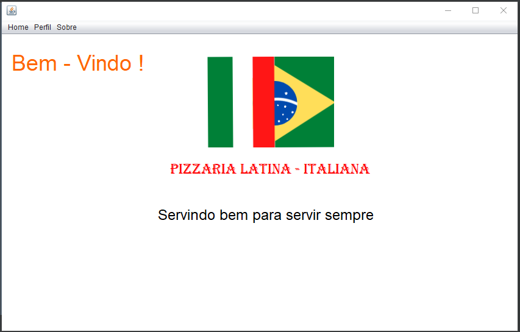

# Ciclo de Vida de um Software

### Exemplo: Pizzaria

## Requesitos Funcionais

- Funcionário pode adcionar, excluir e mostrar os sabores de pizza (Cardápio), pode ser visto tanto pelo Usuário quanto para o Funcionário;
- Funcionário pode criar estoque de alimentos;
- Cliente pode se cadastrar e fazer login no aplicativo, campos: ID, Nome, Endereço, Data de Nascimento;
- Compra de pizzas pelo Cliente;
- Planilha de pedidos para o Funcionário. 

## Requisitos Não Funcionais

- Desempenho -> Tempo de processamento do aplicativo;
- Usabilidade -> Interface Gráfica limpa e de fácil uso;
- Segurança -> Os dados coletados são criptografados para mais segurança;
- Portabilidade -> O aplicativo poderá ser utilizado em diversos dispositivos móveis

  
## Diagrama de Caso de Uso:
 

  
## Diagrama de Classe:
 

   

## Tela de Início:
 
