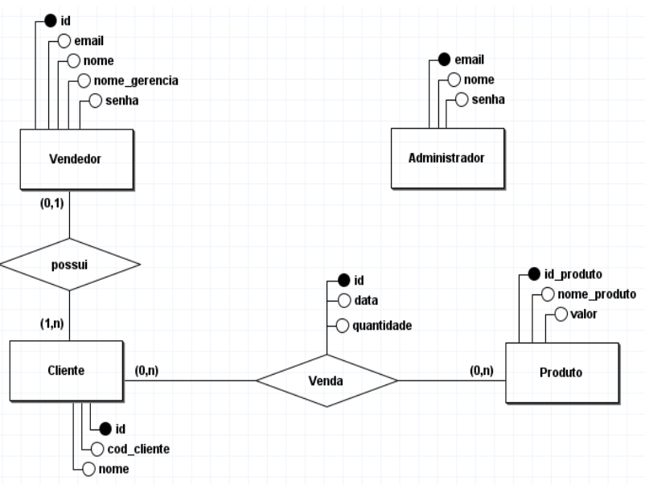

# Portfolio de API'S da graduação de Banco de Dados - Lucas Emanoel 
 
O portfólio tem como objetivo documentar todos os API's (Aprendizagem por Projeto Integrado) para fins educacionais além de servir como trabalho de graduação para a obtenção do diploma de tecnólogo em Banco de Dados proposto pela Faculdade de Tecnologia de São José dos Campos.

 

## Sumário
Link sobre mim
Link dos projetos de API
 

 

## Sobre mim

Me chamo Lucas Emanoel Teixeira Engracio da Silva, tenho 19 anos. Sou técnico em Desenvolvimento de Sistemas pela Etec Profa.
Ilza Nascimento Pintusa - SJC e atualmente estou matriculado no 4° Semestre do curso tecnólogo em Banco de Dados na FATEC de 
São José dos Campos.

Possuo um grande conhecimento na área da tecnologia da informação, já tendo aprendido a construir softwares desktop, aplicações mobile, sistemas embarcados e aplicações web. Porém a minha maior paixão é na área de dados, construindo, manipulando e gerenciando um banco de dados.

Atualmente sou Analista de Testes na empresa Saipher ATC, que tem como ramo de atuação a construção de softwares para auxiliar no trabalho do trafégo aéreo dos aeródromos brasileiros. 

 • <a href="https://www.linkedin.com/in/lucas-emanoel-teixeira-engracio-da-silva-ab5611234/">Linkedin</a> • <a href="https://github.com/lucasetdasilva">Github</a> • 

 

## Meus projetos

### Sistema Gerenciador de Vendas

##### 3° Semestre • 2023-1

Parceiro Acadêmico: DomRock
 

  

O Sistema Gerenciador de Vendas é uma aplicação web voltada para o armazenamento e gerenciamento de vendas realizadas por vendedores. O intuito da aplicação é coletar os dados das vendas e transformar em valor de negócio por meio da geração de insights (gráficos), com isso deixando mais fácil de entender o que realmente está acontecendo com os dados.
  
O sistema também dispõe de um algoritmo que prevê quanto um vendedor precisa vender com base na quantidade planejada de vendas e o que realmente foi realizado.
  

## Tecnologias Utilizadas

* __JavaScript:__ Linguagem de programação frontend;
* __React:__ Framework do JavaScript;
* __Java:__ Linguagem de programação backend;
* __SpringBoot:__ Framework do Java para o mapeamento de tabelas do banco de dados;
* __MySQL:__ SGBD utilizado para o armazenamento de dados;
* __TypeScript:__ Framework do JavaScript; 
* __Tailwind CSS:__ Linguagem de estilização da aplicação web.
    

## Contribuições Pessoais

### Mapeamento de Tabelas

Para que a linguagem de programação Java possa interpretar o Banco de Dados foi necessário realizar o mapeamento das tabelas.

<h4>Mais sobre mapeamento de tabelas</h4>

 O mapeamento de tabelas é um conceito em que associamos classes Java a tabelas de um banco de dados relacional. O mesmo tem como principal objetivo trazer visibilidade dos dados armazenados dentro do banco de dados para o usuário final da aplicação.  

### Criação de rotas REST

As rotas REST fazem parte de uma arquitetura de software que tem como objetivo abrir uma comunicação para transmitir dados entre as tecnologias da aplicação.

### Modelagem do Banco de Dados

Todo sistema por mais simples que aparenta ser, necessita de um banco de dados para que as informações relevantes que percorrem a aplicação não sejam perdidas.

 
<h4>Mais sobre modelagem</h4>

 A primeira etapa que precisei realizar foi o Modelo de Entidade Reacional, ou DER, que tem como objetivo mostrar como deve ser o fluxo de dados dentro do banco de dados. Foi necessário fazer um levantamento de entidades, atributos e quais entidades possuem relacionamentos, levando em consideração o contexto do projeto. Depois de levantar esses quesitos é necessário estudar a cardinalidade entre as entidades, pois com base nela surgirão chaves estrangeiras e tabelas de relação no Modelo de Entidade Relacional.

Após a finalição do DER se faz necessário a criação do Modelo de Entidade Relacional, ou MER, que tem como objetivo criar tabelas e seus relacionamentos como base no modelo conceitual feito anteriormente. Sendo assim, as entidades se tornam tabelas e os atributos viram campos. Com base na cardinalidade das tabelas é necessário criar novas tabelas e criar chaves estrangeiras, isso ajuda o banco a manter sua consistência e diminuir redundâncias.

 
 
 
<h3 align="center">Modelagem de Banco de Dados do projeto</h3>
 

 

### Cadastro do Planejamento de Vendas

## Aprendizados 

