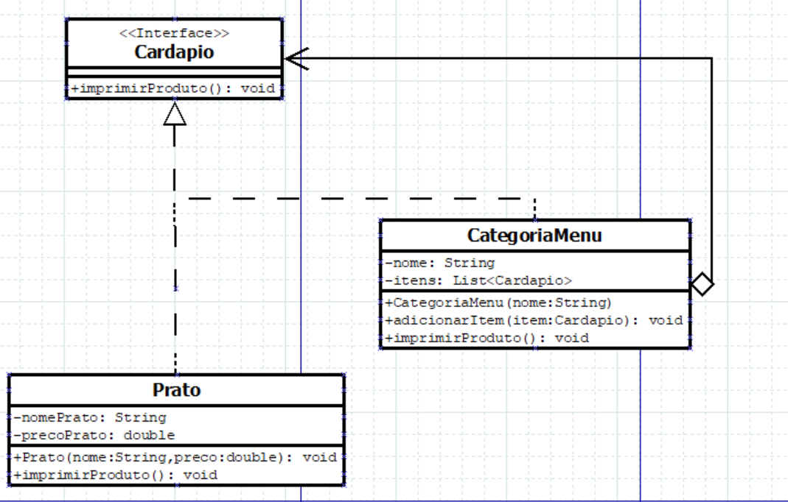

<h1 align = "center">Padrão de Projeto Composite</h1>

 

## O que é o Composite?

O Composite é um padrão de projeto permite tratar objetos individuais e composições de objetos de maneira uniforme, formando uma hierarquia de objetos em que ambos são manipulados de maneira consistente.

 

## Diagrama UML

