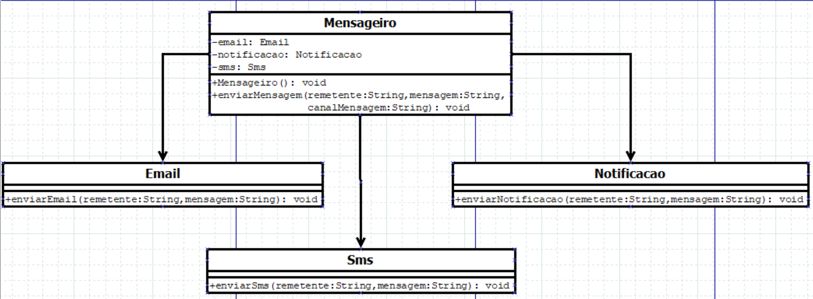

<h1 align = "center">Padrão de Projeto Facade</h1>
 

## O que é o Facade?

O Facade é um padrão de projeto que fornece uma interface unificada simplificada para um conjunto de interfaces em um subsistema.

 

## Diagrama UML

