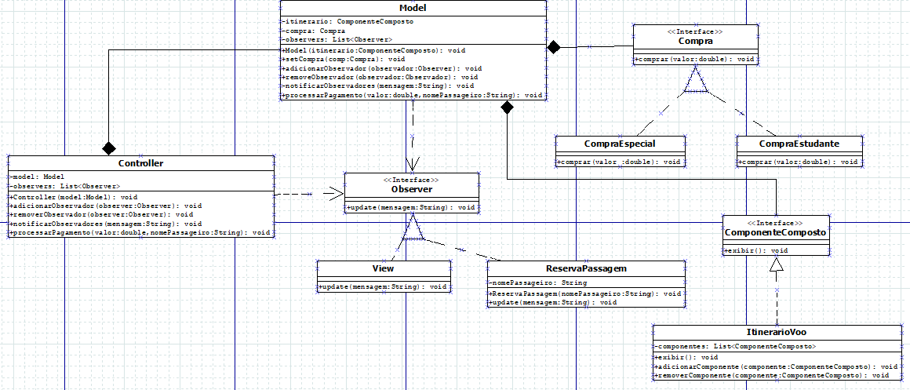

<h1 align = "center">Modelo MVC - Strategy - Observer - Composite</h1>
 

## O que é MVC?

 O padrão de arquitetura Modelo-Visão-Controlador (MVC) é um modelo de design que organiza a estrutura de uma aplicação de software em três componentes principais: Modelo (Model), Visão (View) e Controlador (Controller). Esses componentes colaboram entre si para separar as preocupações relacionadas à lógica de negócios, apresentação e controle de interações.

 

## Diagrama UML

