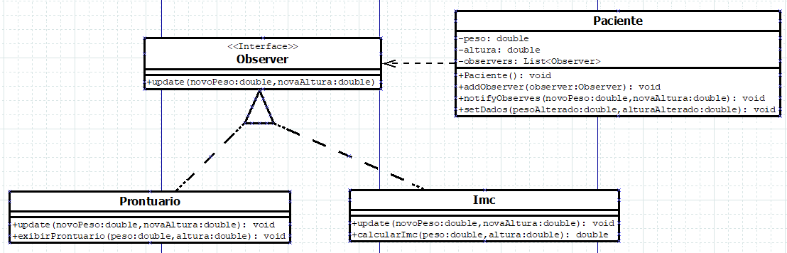

<h1 align = "center">Padrão de Projeto Observer</h1>
 

## O que é o Observer?

 O padrão de projeto Observer estabelece uma dependência um-para-muitos entre objetos, permitindo que um objeto, chamado sujeito, notifique automaticamente todos os seus observadores sobre mudanças de estado.

 

## Diagrama UML

