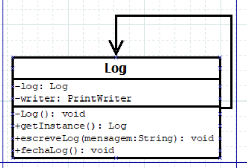

<h1 align = "center">Padrão de Projeto Singleton</h1>
 

## O que é o Singleton?

O Singleton é um padrão de projeto que garante a existência de apenas uma instância de uma determinada classe, fornecendo um ponto global de acesso a essa instância	

 

## Diagrama UML
<!---->
